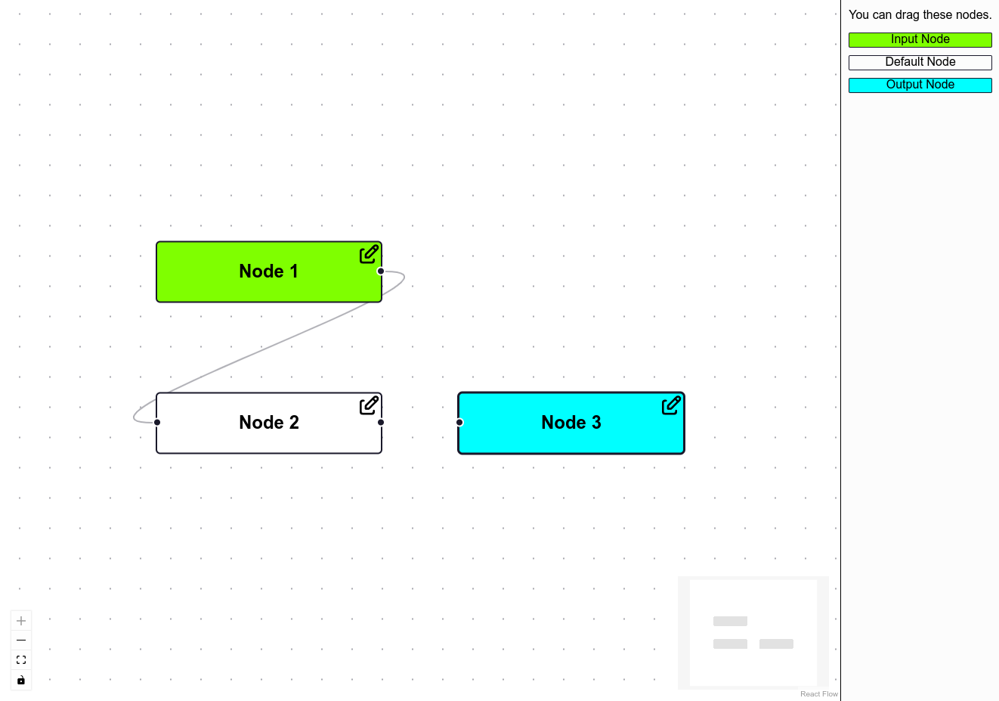
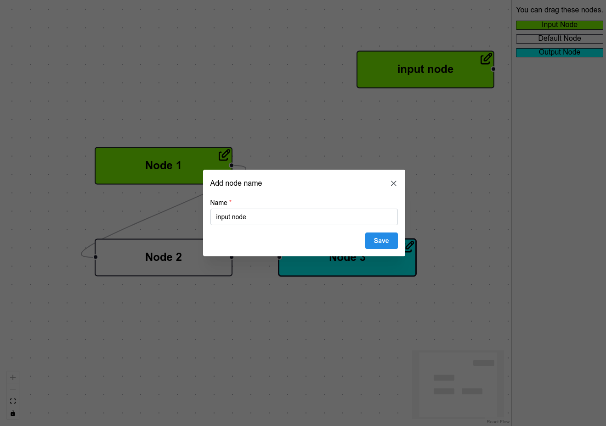
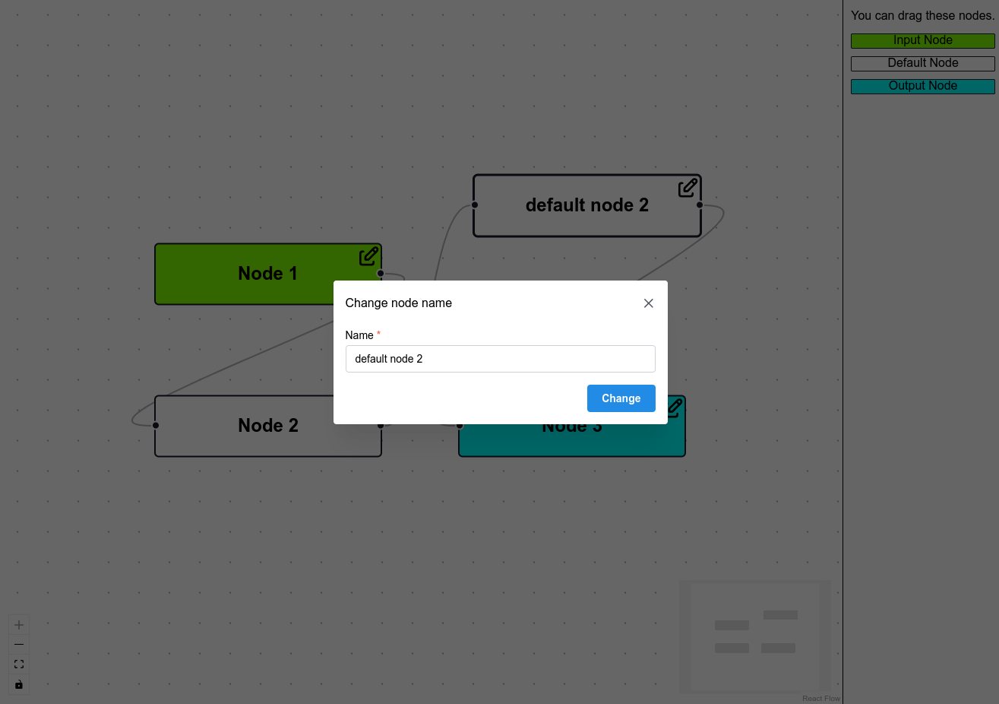
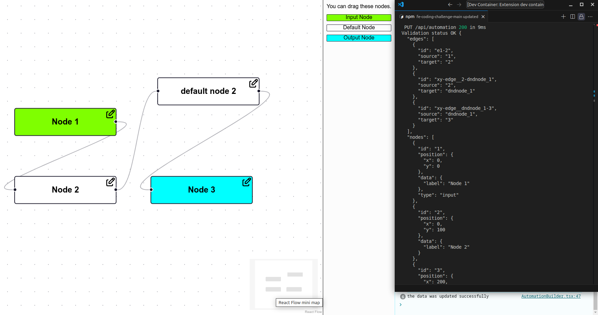

# Information from a candidate

- Modal
  - created a modal allowing the user to edit the node name. You can see the modal when dropping a node to the builder.
  - the modal displays different button name and title depending on creating or renaming type
  - display error if node name is empty
- Saving data
  - limited node and edge fields we want to save.
  - don't save data before initial data was loaded
  - save data using throttle no more than once per 2 seconds. We also save data if edge was moved.
  - data is validated in backend endpoint using zod. You can see the result in server logs "Validation status ...".
- Nodes
  - each node type has a specific color
  - input node has only right handle
  - default node has both left and right handles
  - output node has only left handle
  - save a node after dnd with default name and rename one if modal data was changed
  - editing node by clicking on edit icon on top right node corner
- Libraries
  - mantine for beautiful UI, hooks, form
  - tabler-icons for icons
  - jotai. I wanted to call a function from any place of code for open/close the modal. I prefer this way instead of pass callbacks or using providers. Modal code is clear and business logic is in a separate file. I didn't work with jotai and recoil and I choose jotai because the bundle size is less. 
  - lodash. A lot of awesome function helpers.
  - zod for validation.
- Tests
  - Sorry, I don't have time for tests.
  - This app is small enough and we can use basic e2e tests for checking one.
  - It would be great to cover at least complex logic, BE data validation, react components using unit tests

### Screenshots





---

# !!! The original file starts here !!!

# Senior frontend role

## Create a simple automation builder

The goal of that exercice is to create an automation builder containing nodes (that could be actions) and edges (to link nodes with each other) using the code in this repo.

This repo uses:
 - [Next.js](https://nextjs.org/docs) (React, Typescript)
 - [ReactFlow](https://reactflow.dev/learn)
-  CSS (in order to keep it simple)

Overall feel free to use any libs you want but please explain your reasoning.

Spend the time you want/can allocate, if something isn't fully working/done, just explain what it should have been and how you would have done it.

### Exercice

 - Create/Edit nodes
   - create a modal allowing the user to edit the node name
   - this modal should also opens when dropping a node to the builder
 - Save feature
   - Using Next.js create an endpoint that allows to "save" the nodes/edges
     - don't bother saving it for real, just validate the data
 - Be creative

> Have fun!

### What we expect from you

We are not expecting from candidates to have the best automation builder tool as possible.
We only look at the code, and how you would work in an asynchronous work environment.

 - Clean code
 - Some unit tests
   - Don't write tests just for the sake of writing tests
   - If you don't have time to write them, list them and explain the strategy
 - Some nice UI

## Getting Started

First, run the development server:

```bash
nvm use
npm i
npm run dev
```

Open [http://localhost:3000](http://localhost:3000) with your browser to see the result.

